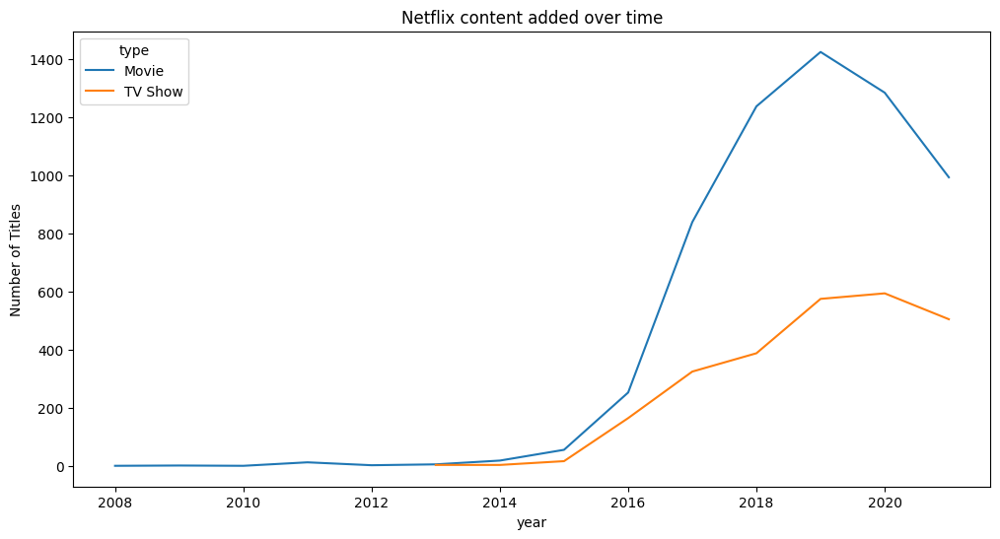
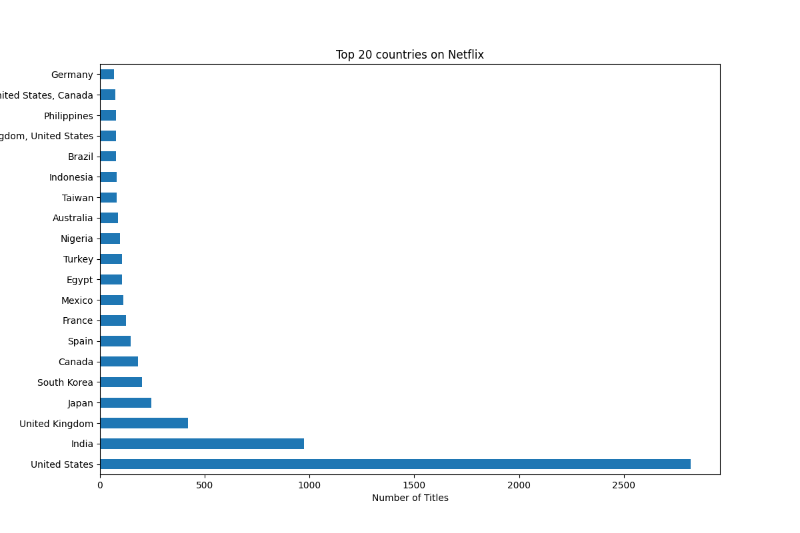
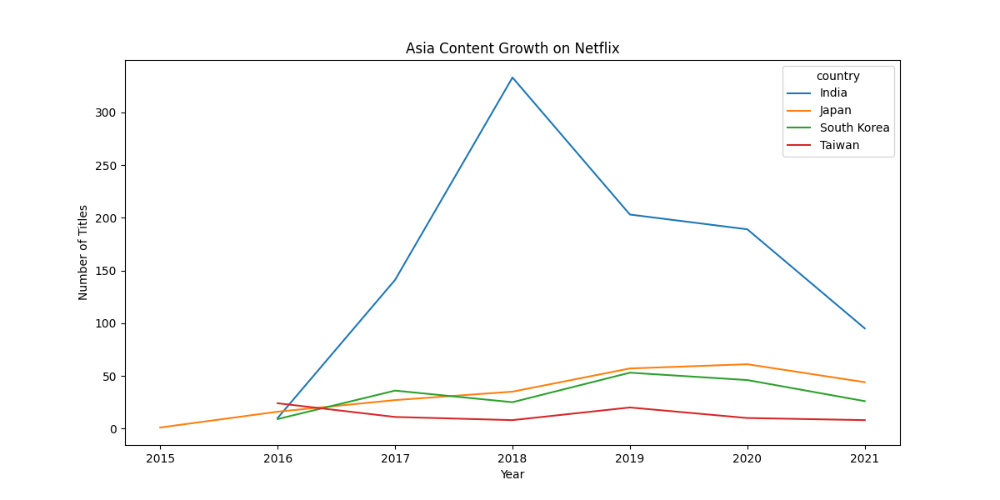

# Netflix Global Content Strategy Analysis

## Project Overview

Netflix has evolved from a U.S.-centered streaming platform into a global entertainment ecosystem. As international markets become increasingly important, understanding how Netflix expands and distributes content across regions may provide valuable insight into its globalization strategy and future investment priorities.

This project analyzes Netflix's global catalog using Python, focusing on:

* Global content expansion
* Country-level distribution
* Asian market growth
* International co-productions
* Genre preference by region
* Content duration patterns
* Potential audience engagement behavior
* Future content investment directions

Rather than only describing historical trends, this project aims to explore how data analysis can support future content acquisition and platform strategy decisions.

---

## Dataset

Source: Netflix Titles Dataset (Kaggle)

The dataset contains information on Netflix Movies and TV Shows, including:

* Title
* Type (Movie / TV Show)
* Country
* Date Added
* Release Year
* Genre
* Duration
* Rating

---

## Business Questions

This project investigates several business-oriented questions:

1. How has Netflix expanded its global catalog over time?
2. Which countries contribute the most content to Netflix?
3. How has Asian content evolved in recent years?
4. Are international co-productions becoming more common?
5. How do genre preferences differ across countries and regions?
6. How are duration patterns changing over time?
7. Do different markets emphasize short-form or long-form content differently?
8. What kinds of content may deserve stronger future investment in different markets?

---

## Tools and Technologies

* Python
* Pandas
* Matplotlib
* Jupyter Notebook
* Git
* GitHub

---

## Project Structure

```text
Netflix-Global-Content-Analysis
│
├── data
│   └── netflix_titles.csv
│
├── figures
│   ├── netflix_content_added_over_time.png
│   ├── top20_countries.png
│   ├── asia_content_growth.png
│   └── share_of_international_coproductions_on_netflix.png
│
├── README.md
│
└── netflix_global_content_analysis.ipynb
```

---

## Key Findings

### 1. Rapid Global Catalog Expansion

Netflix experienced significant catalog growth between 2016 and 2020.

Movies continue to dominate the platform overall, while TV Shows demonstrated particularly strong growth after 2018.

---

### 2. Continued U.S. Dominance

The United States remains the largest contributor to Netflix's catalog.

Its content volume substantially exceeds that of other countries, highlighting the continued strategic importance of the domestic market.

---

### 3. Growth of Asian Content

India demonstrated the strongest catalog expansion among Asian countries.

Japan and South Korea showed steady and sustained growth, suggesting increasing strategic importance within Netflix's international content portfolio.

Taiwan contributed a smaller number of titles and exhibited more limited growth.

---

### 4. International Co-Productions

The number of international co-productions increased after 2015.

However, the proportion of co-produced titles within Netflix's overall catalog remained relatively stable over time.

This suggests that Netflix's globalization strategy may rely more heavily on geographically diversified content acquisition rather than rapidly increasing dependence on co-production partnerships.

---

## Strategic Perspective

This project emphasizes the business value of data analysis rather than purely descriptive visualization.

The goal is to move from:

> "What happened?"

toward:

> "What content strategies may be valuable in the future?"

The analysis therefore focuses on identifying patterns that may support future decision-making in:

* Content acquisition
* Regional investment
* Genre diversification
* Audience engagement
* International market positioning

---

## Behavioral & Content Strategy Analysis

Future stages of this project will further explore the relationship between:

* Genre and country
* Genre and duration
* Duration and rating
* Long-form vs short-form content expansion
* Regional differences in content composition

The project aims to investigate whether certain regions emphasize:

* shorter, faster-consumption content
* long-form serialized storytelling
* genre-specific audience retention strategies

These analyses may provide insight into potential audience engagement behavior and future content investment priorities.

The project also aims to distinguish between:

* observable catalog trends
  and
* broader audience behavior hypotheses

to avoid over-interpreting platform-level data without direct viewership evidence.

---

## Visualizations

### Content Growth Over Time



### Top 20 Content-Producing Countries



### Asian Content Growth



### Share of International Co-Productions


---

## Future Work

Planned extensions of this project include:

* Country-level genre preference analysis
* Genre-duration relationship analysis
* Regional market share comparison
* Asia vs Europe vs Latin America content strategies
* Market gap identification for future content investment
* Country network analysis of international co-productions
* Integration of audience viewership data
* Recommendation-system-oriented analysis
* Long-form vs short-form content trend analysis
* Content investment forecasting

Future analyses will focus more heavily on generating actionable business insights rather than only describing historical trends.

---

## Author

Chunyu Liu

Graduate Student in Biostatistics
Rutgers University

Interested in:

* Data Science
* Media Analytics
* Streaming Platform Strategy
* Global Content Distribution
* Business-Oriented Data Analytics
