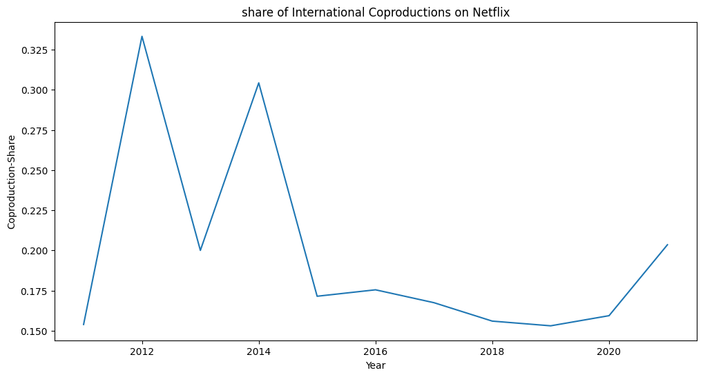
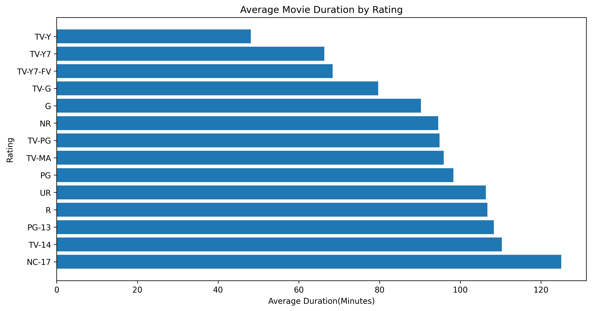
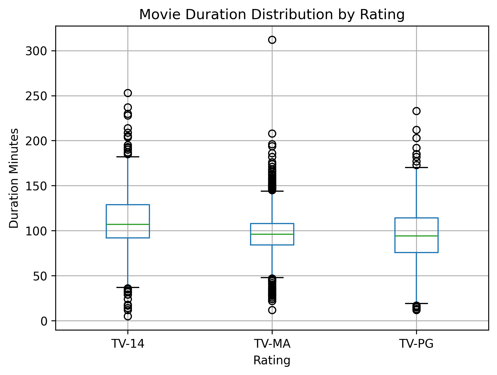
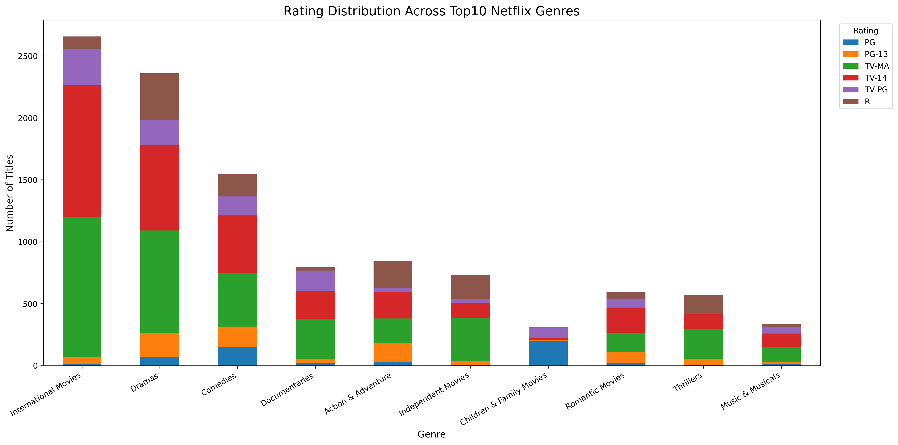
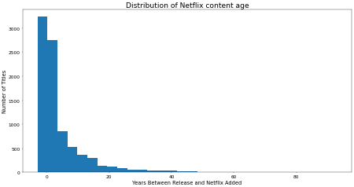

# Netflix Global Content Analysis

Business-oriented exploratory analysis of Netflix's global content strategy using Python.

## Project Overview

Netflix has evolved from a U.S.-centered streaming platform into a global entertainment ecosystem. As international markets become increasingly important, understanding how Netflix expands and distributes content across regions may provide valuable insight into its globalization strategy and future investment priorities.

This project analyzes Netflix's global catalog using Python, focusing on:

* Global content expansion
* Country-level distribution
* Asian market growth
* International co-productions
* Genre preference by region
* Content duration patterns
* Potential audience engagement behavior
* Future content investment directions

Rather than only describing historical trends, this project aims to explore how data analysis can support future content acquisition and platform strategy decisions.

---

## Dataset

Source: Netflix Titles Dataset (Kaggle)

The dataset contains information on Netflix Movies and TV Shows, including:

* Title
* Type (Movie / TV Show)
* Country
* Date Added
* Release Year
* Genre
* Duration
* Rating

---

## Business Questions

This project investigates several business-oriented questions:

1. How has Netflix expanded its global catalog over time?
2. Which countries contribute the most content to Netflix?
3. How has Asian content evolved in recent years?
4. Are international co-productions becoming more common?
5. How do genre preferences differ across countries and regions?
6. How are duration patterns changing over time?
7. Do different markets emphasize short-form or long-form content differently?
8. What kinds of content may deserve stronger future investment in different markets?

---

## Tools and Technologies

* Python
* Pandas
* Matplotlib
* Jupyter Notebook
* Git
* GitHub

---

## Project Structure

```text
Netflix-Global-Content-Analysis
│
├── data
│   └── netflix_titles.csv
│
├── figures
│   ├── netflix_content_added_over_time.png
│   ├── top20_countries.png
│   ├── asia_content_growth.png
│   ├── share_of_international_coproductions_on_netflix.png
│   ├── us_genre_top10.png
│   ├── india_genre_top10.png
│   ├── uk_genre_top10.png
│   ├── japan_genre_top10.png
│   ├── south_korea_genre_top10.png
│   ├── canada_genre_top10.png
│   ├── average_movie_duration_by_rating.png
│   ├── movie_duration_distribution_by_rating.png
│   ├── top10_genres_rating_distribution.png
│   └── content_age_distribution.png
│
├── README.md
│
└── netflix_global_content_analysis.ipynb
```


---


## Strategic Perspective

This project emphasizes the business value of data analysis rather than purely descriptive visualization.

The goal is to move from:

> "What happened?"

toward:

> "What content strategies may be valuable in the future?"

The analysis therefore focuses on identifying patterns that may support future decision-making in:

* Content acquisition
* Regional investment
* Genre diversification
* Audience engagement
* International market positioning

---

# Analysis Sections

### 1. Global Expansion Analysis

### 2. Country-Specific Genre Analysis

### 3. Duration Analysis

### 4. Rating Analysis

### 5. Content Age Analysis

---

## Global Expansion Analysis

## Key Findings

### 1. Rapid Global Catalog Expansion

Netflix experienced significant catalog growth between 2016 and 2020.

Movies continue to dominate the platform overall, while TV Shows demonstrated particularly strong growth after 2018.

### 2. Continued U.S. Dominance

The United States remains the largest contributor to Netflix's catalog.

Its content volume substantially exceeds that of other countries, highlighting the continued strategic importance of the domestic market.

### 3. Growth of Asian Content

India demonstrated the strongest catalog expansion among Asian countries.

Japan and South Korea showed steady and sustained growth, suggesting increasing strategic importance within Netflix's international content portfolio.

Taiwan contributed a smaller number of titles and exhibited more limited growth.

### 4. International Co-Productions

The number of international co-productions increased after 2015.

However, the proportion of co-produced titles within Netflix's overall catalog remained relatively stable over time.

This suggests that Netflix's globalization strategy may rely more heavily on geographically diversified content acquisition rather than rapidly increasing dependence on co-production partnerships.


## Visualizations

### Content Growth Over Time


### Top 20 Content-Producing Countries


### Asian Content Growth


### Co-Productions Growth


### Share of International Co-Productions




---

## Country-Specific Genre Analysis

This section explores the genre composition of Netflix content across several major markets, including the United States, India, the United Kingdom, Japan, South Korea, and Canada.
The analysis compares differences in content specialization, television-oriented storytelling, and genre concentration patterns across countries.

## Key Findings

 * The United States demonstrates relatively balanced genre representation.

 * India shows stronger concentration in drama-oriented and movie-focused genres.

 * South Korea emphasizes television-oriented storytelling and romantic TV content.

 * Japan demonstrates strong specialization in anime and serialized television content.

 * Canada maintains a relatively balanced mix of family-oriented and entertainment-focused genres.

 * The United Kingdom demonstrates a strong domestic television identity through British TV content.


## Visualizations

### United States Genre Distribution


### India Genre Distribution


### United Kingdom Genre Distribution


### Japan Genre Distribution


### South Korea Genre Distribution


### Canada Genre Distribution


---

## Duration Analysis

This section investigates Netflix content duration patterns and their potential relationship to audience engagement behavior and platform content strategy.

The analysis focuses on:

* Distribution of movie durations
* Duration differences across audience ratings
* Average movie duration by rating category
* Long-form vs short-form storytelling patterns
* Potential relationships between content maturity and viewing length

## Key Findings

* Most Netflix movies are concentrated within standard feature-length ranges, particularly between approximately 80 and 120 minutes.

* Mature audience categories such as TV-MA and R-rated content generally demonstrate longer average durations compared to family-oriented categories.

* Family-oriented and children's content tends to exhibit shorter duration patterns, suggesting different engagement and viewing strategies across audience segments.

* Duration variability is substantially larger among mature-content categories, indicating broader experimentation with storytelling complexity and pacing.

## Business Insight

The results suggest that Netflix may apply differentiated content-duration strategies across audience segments. Mature audience content appears more associated with long-form storytelling and extended engagement, while family-oriented content emphasizes shorter and more accessible viewing formats.

These patterns may reflect broader platform objectives related to binge-watching behavior, retention strategy, and audience-specific content consumption preferences.

## Visualizations

### Average Movie Duration by Rating



### Movie Duration Distribution by Rating




---

## Rating Analysis

This section explores how Netflix distributes audience-targeting ratings across genres and content categories.

The analysis focuses on:

* Overall rating distribution
* Rating distribution across top genres
* Audience segmentation patterns
* Mature-content vs family-oriented content strategies

## Key Findings

* TV-MA and TV-14 dominate Netflix's catalog across most major genres, indicating strong emphasis on teen and adult audiences.

* International Movies and Dramas contain particularly large proportions of mature-rated content.

* Family-oriented genres demonstrate significantly higher proportions of PG and TV-PG ratings, reflecting differentiated audience targeting strategies.

* Rating distributions vary substantially across genres, suggesting that Netflix applies genre-specific audience positioning approaches.

## Business Insight

The analysis suggests that Netflix's overall platform strategy is heavily oriented toward mature audience engagement while maintaining selective diversification into family-oriented categories.

The dominance of mature-rated content may reflect the platform's emphasis on long-form engagement, serialized storytelling, and audience retention among adult viewers.

## Visualizations

### Rating Distribution Across Top Genres




---

## Content Age Analysis

This section investigates how quickly Netflix adds content to its platform after original release, with the goal of exploring potential content acquisition and platform freshness strategies.

The analysis focuses on:

* Distribution of content age
* Time gap between release year and Netflix addition year
* Recent vs legacy content patterns
* Differences between Movies and TV Shows

## Key Findings

* Most Netflix titles are added to the platform within a relatively short period after release, indicating strong preference for recent content.

* The content age distribution is right-skewed, with a smaller number of older titles extending the long tail of the distribution.

* The median content age is lower than the mean content age, suggesting that older legacy titles increase the overall average.

* TV Shows generally demonstrate lower average content age compared to Movies, reflecting faster platform integration and stronger emphasis on serialized engagement-driven content.

## Business Insight

The results suggest that Netflix prioritizes platform freshness through relatively recent content acquisition while simultaneously maintaining a smaller catalog of legacy and classic titles.

The faster integration cycle observed for TV Shows may reflect the growing importance of episodic storytelling in driving long-term viewer retention and binge-watching behavior.

## Visualization

### Distribution of Netflix Content Age




---
 ## Future Work

Potential future extensions of this project include:

* Recommendation-system-oriented content similarity analysis
* SQL-based analytics workflows
* Genre co-occurrence analysis
* International co-production network visualization
* Audience segmentation modeling
* Machine-learning approaches for content clustering and trend prediction

Future work may further explore how catalog-level patterns relate to platform engagement, recommendation systems, and content investment strategies.


---

## Author

Chunyu Liu

Graduate Student in Biostatistics
Rutgers University

Interested in:

* Data Science
* Media Analytics
* Streaming Platform Strategy
* Global Content Distribution
* Business-Oriented Data Analytics

