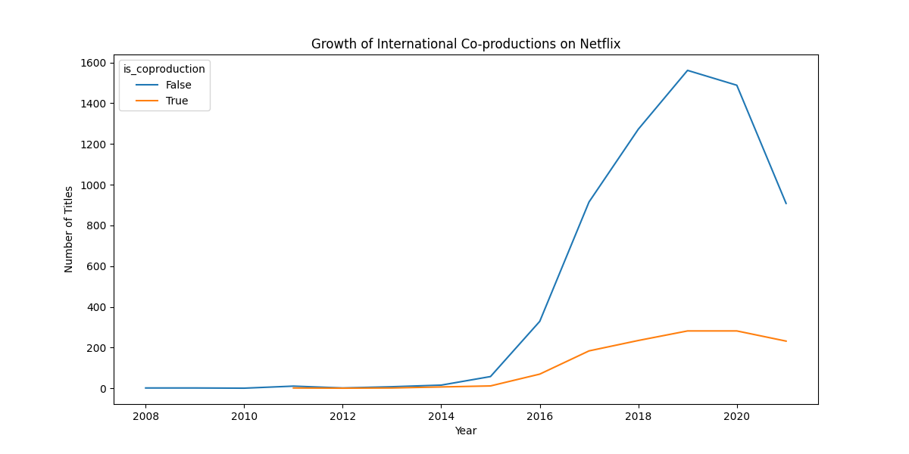
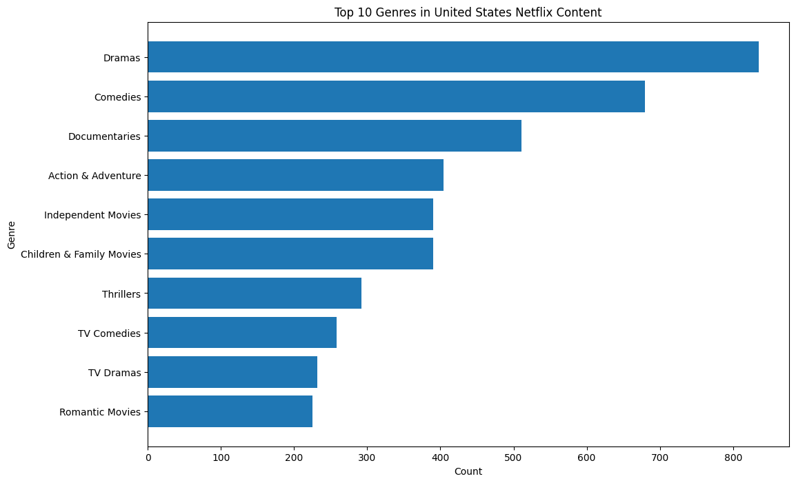
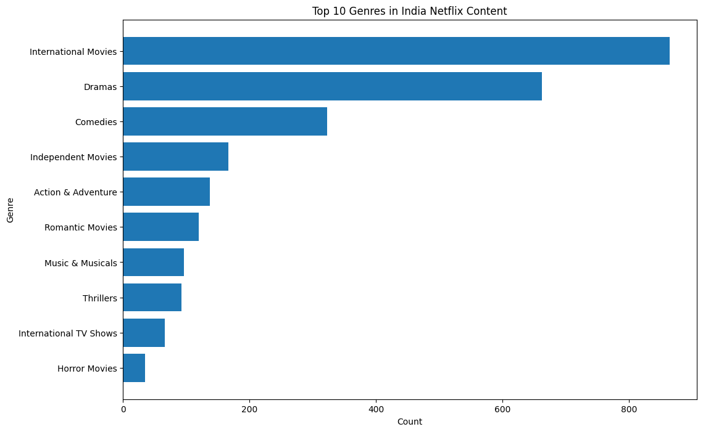
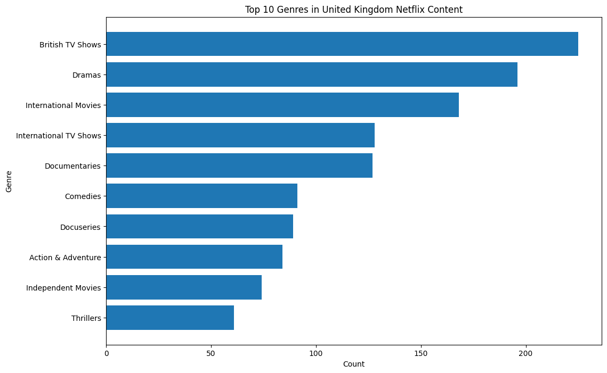
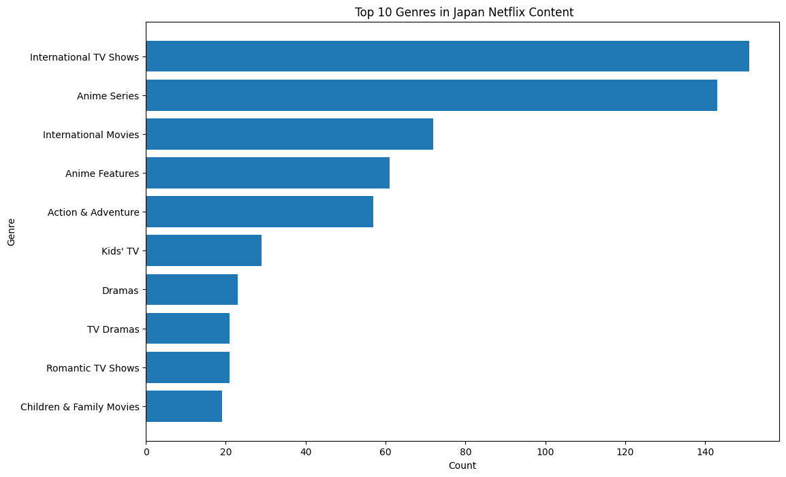
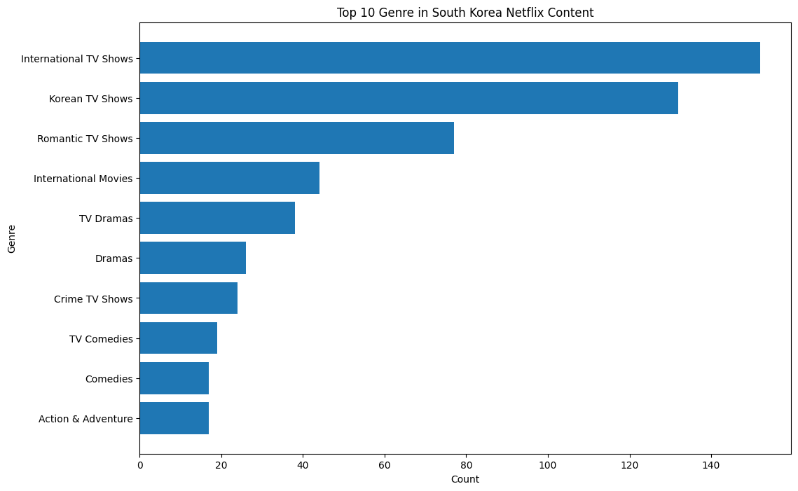
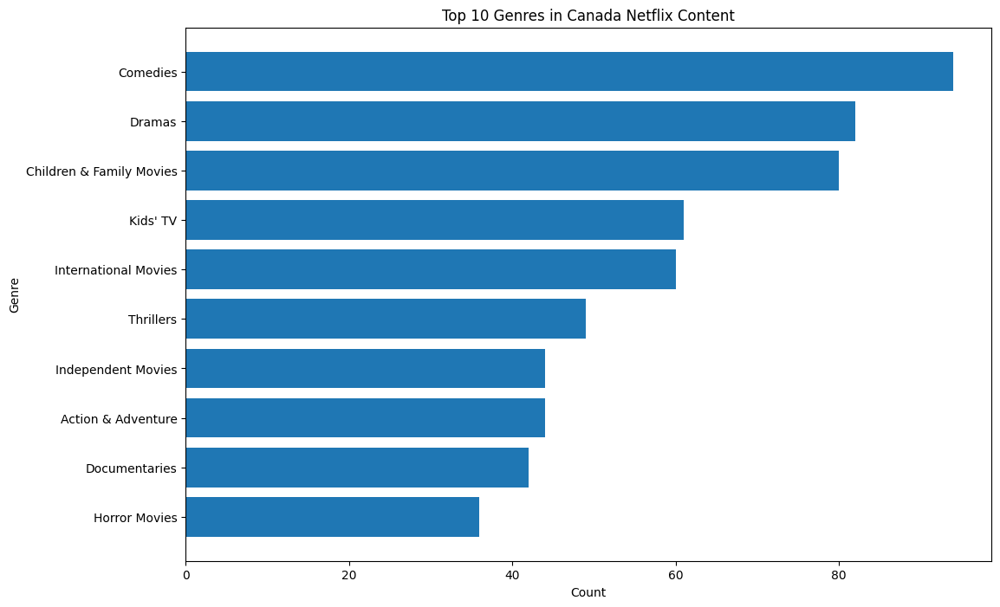

# Netflix Global Content Analysis

Business-oriented exploratory analysis of Netflix's global content strategy using Python.

## Project Overview

Netflix has evolved from a U.S.-centered streaming platform into a global entertainment ecosystem. As international markets become increasingly important, understanding how Netflix expands and distributes content across regions may provide valuable insight into its globalization strategy and future investment priorities.

This project analyzes Netflix's global catalog using Python, focusing on:

* Global content expansion
* Country-level distribution
* Asian market growth
* International co-productions
* Genre preference by region
* Content duration patterns
* Potential audience engagement behavior
* Future content investment directions

Rather than only describing historical trends, this project aims to explore how data analysis can support future content acquisition and platform strategy decisions.

---

## Dataset

Source: Netflix Titles Dataset (Kaggle)

The dataset contains information on Netflix Movies and TV Shows, including:

* Title
* Type (Movie / TV Show)
* Country
* Date Added
* Release Year
* Genre
* Duration
* Rating

---

## Business Questions

This project investigates several business-oriented questions:

1. How has Netflix expanded its global catalog over time?
2. Which countries contribute the most content to Netflix?
3. How has Asian content evolved in recent years?
4. Are international co-productions becoming more common?
5. How do genre preferences differ across countries and regions?
6. How are duration patterns changing over time?
7. Do different markets emphasize short-form or long-form content differently?
8. What kinds of content may deserve stronger future investment in different markets?

---

## Tools and Technologies

* Python
* Pandas
* Matplotlib
* Jupyter Notebook
* Git
* GitHub

---

## Project Structure

```text
Netflix-Global-Content-Analysis
│
├── data
│   └── netflix_titles.csv
│
├── figures
│   ├── netflix_content_added_over_time.png
│   ├── top20_countries.png
│   ├── asia_content_growth.png
│   ├── share_of_international_coproductions_on_netflix.png
│   ├── us_genre_top10.png
│   ├── india_genre_top10.png
│   ├── uk_genre_top10.png
│   ├── japan_genre_top10.png
│   ├── south_korea_genre_top10.png
│   └── canada_genre_top10.png
│
├── README.md
│
└── netflix_global_content_analysis.ipynb

```

---


## Strategic Perspective

This project emphasizes the business value of data analysis rather than purely descriptive visualization.

The goal is to move from:

> "What happened?"

toward:

> "What content strategies may be valuable in the future?"

The analysis therefore focuses on identifying patterns that may support future decision-making in:

* Content acquisition
* Regional investment
* Genre diversification
* Audience engagement
* International market positioning

---

# Analysis Sections

### 1. Global Expansion Analysis

### 2. Country-Specific Genre Analysis

### 3. Duration Analysis

### 4. Rating Analysis

---

## Global Expansion Analysis

## Key Findings

### 1. Rapid Global Catalog Expansion

Netflix experienced significant catalog growth between 2016 and 2020.

Movies continue to dominate the platform overall, while TV Shows demonstrated particularly strong growth after 2018.

### 2. Continued U.S. Dominance

The United States remains the largest contributor to Netflix's catalog.

Its content volume substantially exceeds that of other countries, highlighting the continued strategic importance of the domestic market.

### 3. Growth of Asian Content

India demonstrated the strongest catalog expansion among Asian countries.

Japan and South Korea showed steady and sustained growth, suggesting increasing strategic importance within Netflix's international content portfolio.

Taiwan contributed a smaller number of titles and exhibited more limited growth.

### 4. International Co-Productions

The number of international co-productions increased after 2015.

However, the proportion of co-produced titles within Netflix's overall catalog remained relatively stable over time.

This suggests that Netflix's globalization strategy may rely more heavily on geographically diversified content acquisition rather than rapidly increasing dependence on co-production partnerships.


## Visualizations

### Content Growth Over Time


### Top 20 Content-Producing Countries


### Asian Content Growth


### Share of International Co-Productions



---

## Country-Specific Genre Analysis

This section explores the genre composition of Netflix content across several major markets, including the United States, India, the United Kingdom, Japan, South Korea, and Canada.
The analysis compares differences in content specialization, television-oriented storytelling, and genre concentration patterns across countries.

## Key Findings

 * The United States demonstrates relatively balanced genre representation.

 * India shows stronger concentration in drama-oriented and movie-focused genres.

 * South Korea emphasizes television-oriented storytelling and romantic TV content.

 * Japan demonstrates strong specialization in anime and serialized television content.

 * Canada maintains a relatively balanced mix of family-oriented and entertainment-focused genres.

 * The United Kingdom demonstrates a strong domestic television identity through British TV content.


## Visualizations

### United States Genre Distribution



### India Genre Distribution



### United Kingdom Genre Distribution



### Japan Genre Distribution



### South Korea Genre Distribution



### Canada Genre Distribution



---

## Duration Analysis

(Work in Progress)

Future analysis will investigate:

* Movie vs TV Show duration patterns
* Long-form vs short-form storytelling
* Country-specific duration preferences
* Serialized content expansion trends

---

## Rating Analysis

(Planned)

* Future analysis will investigate:
* Rating distribution across countries
* Genre-specific audience targeting
* TV-MA vs TV-14 market differences
* Family-oriented vs mature-content strategies

---
 ## Future Work

Planned extensions of this project include:

* Genre-duration relationship analysis
* Rating distribution analysis across countries and genres
* Long-form vs short-form content trend analysis
* Country-level duration preference analysis
* Genre concentration analysis
* International co-production network analysis
* Additional business-oriented content strategy interpretation

Future analyses will continue to explore observable content distribution patterns while avoiding unsupported assumptions beyond the available catalog-level data. The project aims to generate actionable business insights while maintaining clear boundaries between catalog trends and broader audience behavior hypotheses.


---

## Author

Chunyu Liu

Graduate Student in Biostatistics
Rutgers University

Interested in:

* Data Science
* Media Analytics
* Streaming Platform Strategy
* Global Content Distribution
* Business-Oriented Data Analytics

